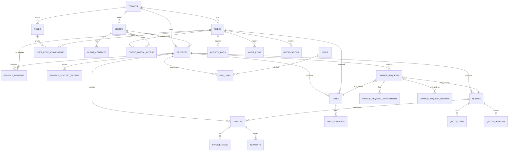

# CRM Data Model

## Objetivo
Definir un modelo de datos base para el CRM con soporte para backoffice, portal cliente, presupuestos, facturas, archivos, tareas, solicitudes de cambio y auditoría.

## Orden recomendado
1. Tenant, usuarios, clientes y permisos
2. Proyectos como entidad central
3. Tareas y contexto operativo
4. Presupuestos y facturas
5. Archivos, comentarios y solicitudes de cambio
6. Actividad, auditoría y notificaciones

## Checklist técnico
- Entidades núcleo y relaciones principales definidas
- Estados y enums críticos identificados
- Campos de auditoría homogéneos
- Decisión multi-tenant documentada
- Soft delete/archivado definido por módulo
- Base lista para trasladar a TypeORM

## Criterios de aceptación
- El modelo cubre los módulos del roadmap del CRM
- Se entiende qué tablas van primero y cuáles dependen de otras
- Hay relaciones claras entre panel interno y portal cliente
- Auditoría y permisos quedan contemplados desde el diseño

## Decisiones base
- **Tenant-first**: todas las entidades de negocio cuelgan de `tenant_id` salvo catálogos globales controlados.
- **UUID público + ID interno**: usar `id` numérico interno y `uuid` para exponer referencias en URLs/APIs externas.
- **Auditoría homogénea**: todas las entidades de negocio incluyen `created_at`, `updated_at`, `created_by`, `updated_by`, `archived_at` cuando aplique.
- **Soft delete**: recomendado en clientes, proyectos, tareas, presupuestos, facturas, archivos y solicitudes de cambio.
- **Comentarios internos vs cliente**: distinguir con flag de visibilidad en vez de mezclar canales.

## Dominios

### 1. Identidad y acceso
- `tenants`
- `users`
- `roles`
- `permissions`
- `user_role_assignments`
- `client_portal_access`

### 2. CRM núcleo
- `clients`
- `client_contacts`
- `projects`
- `project_members`
- `project_context_entries`

### 3. Operativa
- `tasks`
- `task_comments`
- `task_views` (configuración guardada opcional)
- `change_requests`
- `change_request_attachments`
- `change_request_reviews`

### 4. Comercial y facturación
- `quotes`
- `quote_items`
- `quote_versions`
- `invoices`
- `invoice_items`
- `payments`

### 5. Documentación y archivos
- `files`
- `file_links`
- `documents` (si se separa metadato funcional del fichero físico)

### 6. Sistema
- `activity_logs`
- `audit_logs`
- `notifications`
- `notification_deliveries`

## ERD lógico

## Entidades propuestas

### tenants
| Campo | Tipo | Notas |
| --- | --- | --- |
| id | bigint PK | interno |
| uuid | varchar unique | referencia pública |
| name | varchar | nombre comercial |
| slug | varchar unique | subdominio o clave |
| status | enum(active, suspended) | estado |
| created_at | datetime | auditoría |
| updated_at | datetime | auditoría |

### users
| Campo | Tipo | Notas |
| --- | --- | --- |
| id | bigint PK | interno |
| uuid | varchar unique | público |
| tenant_id | FK tenants.id | aislamiento |
| email | varchar unique scoped | login |
| password_hash | varchar nullable | si login local |
| full_name | varchar | |
| status | enum(active, invited, disabled) | |
| last_login_at | datetime nullable | |
| created_by | FK users.id nullable | auditoría |
| updated_by | FK users.id nullable | auditoría |
| created_at | datetime | |
| updated_at | datetime | |

### roles
| Campo | Tipo | Notas |
| --- | --- | --- |
| id | bigint PK | |
| tenant_id | FK tenants.id nullable | null si rol global |
| key | varchar | admin, staff, client |
| name | varchar | |
| is_system | boolean | |

### user_role_assignments
| Campo | Tipo | Notas |
| --- | --- | --- |
| id | bigint PK | |
| user_id | FK users.id | |
| role_id | FK roles.id | |
| scope_type | enum(global, project, client) | alcance |
| scope_id | bigint nullable | según alcance |

### clients
| Campo | Tipo | Notas |
| --- | --- | --- |
| id | bigint PK | |
| uuid | varchar unique | |
| tenant_id | FK tenants.id | |
| legal_name | varchar | razón social |
| trade_name | varchar nullable | |
| tax_id | varchar nullable | NIF/CIF |
| billing_email | varchar nullable | |
| phone | varchar nullable | |
| status | enum(active, lead, inactive, archived) | |
| notes_internal | text nullable | interno |
| created_by | FK users.id nullable | |
| updated_by | FK users.id nullable | |
| archived_at | datetime nullable | soft delete |
| created_at | datetime | |
| updated_at | datetime | |

### client_contacts
| Campo | Tipo | Notas |
| --- | --- | --- |
| id | bigint PK | |
| client_id | FK clients.id | |
| name | varchar | |
| email | varchar nullable | |
| phone | varchar nullable | |
| role_label | varchar nullable | |
| is_primary | boolean | |

### client_portal_access
| Campo | Tipo | Notas |
| --- | --- | --- |
| id | bigint PK | |
| tenant_id | FK tenants.id | |
| client_id | FK clients.id | |
| user_id | FK users.id | usuario tipo cliente |
| status | enum(invited, active, revoked) | |
| invited_at | datetime | |
| accepted_at | datetime nullable | |

### projects
| Campo | Tipo | Notas |
| --- | --- | --- |
| id | bigint PK | |
| uuid | varchar unique | |
| tenant_id | FK tenants.id | |
| client_id | FK clients.id | |
| quote_id | FK quotes.id nullable | presupuesto origen |
| name | varchar | |
| slug | varchar nullable | |
| status | enum(draft, active, paused, delivered, maintenance, archived) | |
| priority | enum(low, medium, high, urgent) | |
| start_date | date nullable | |
| due_date | date nullable | |
| budget_amount | decimal(12,2) nullable | |
| health | enum(on_track, at_risk, blocked) nullable | |
| summary | text nullable | resumen ejecutivo |
| created_by | FK users.id nullable | |
| updated_by | FK users.id nullable | |
| archived_at | datetime nullable | |
| created_at | datetime | |
| updated_at | datetime | |

### project_members
| Campo | Tipo | Notas |
| --- | --- | --- |
| id | bigint PK | |
| project_id | FK projects.id | |
| user_id | FK users.id | |
| responsibility | enum(owner, manager, contributor, reviewer) | |
| hourly_cost | decimal(10,2) nullable | opcional |

### project_context_entries
| Campo | Tipo | Notas |
| --- | --- | --- |
| id | bigint PK | |
| project_id | FK projects.id | |
| type | enum(note, decision, link, milestone, incident) | |
| title | varchar | |
| content | longtext | |
| visibility | enum(internal, client) | |
| related_file_id | FK files.id nullable | |
| happened_at | datetime nullable | orden temporal |
| created_by | FK users.id nullable | |
| created_at | datetime | |
| updated_at | datetime | |

### tasks
| Campo | Tipo | Notas |
| --- | --- | --- |
| id | bigint PK | |
| uuid | varchar unique | |
| tenant_id | FK tenants.id | |
| project_id | FK projects.id | |
| change_request_id | FK change_requests.id nullable | origen opcional |
| parent_task_id | FK tasks.id nullable | subtareas |
| title | varchar | |
| description | longtext nullable | |
| status | enum(backlog, todo, in_progress, blocked, review, done, archived) | |
| priority | enum(low, medium, high, urgent) | |
| assignee_id | FK users.id nullable | |
| start_date | datetime nullable | |
| due_date | datetime nullable | |
| completed_at | datetime nullable | |
| position | int nullable | orden manual |
| created_by | FK users.id nullable | |
| updated_by | FK users.id nullable | |
| archived_at | datetime nullable | |
| created_at | datetime | |
| updated_at | datetime | |

### task_comments
| Campo | Tipo | Notas |
| --- | --- | --- |
| id | bigint PK | |
| task_id | FK tasks.id | |
| author_id | FK users.id | |
| body | longtext | |
| visibility | enum(internal, client) | |
| created_at | datetime | |
| updated_at | datetime | |

### quotes
| Campo | Tipo | Notas |
| --- | --- | --- |
| id | bigint PK | |
| uuid | varchar unique | |
| tenant_id | FK tenants.id | |
| client_id | FK clients.id | |
| project_id | FK projects.id nullable | |
| quote_number | varchar unique scoped | |
| title | varchar | |
| status | enum(draft, sent, accepted, rejected, expired) | |
| currency | char(3) | EUR por defecto |
| subtotal | decimal(12,2) | |
| discount_total | decimal(12,2) | |
| tax_total | decimal(12,2) | |
| total | decimal(12,2) | |
| valid_until | date nullable | |
| accepted_at | datetime nullable | |
| created_by | FK users.id nullable | |
| updated_by | FK users.id nullable | |
| archived_at | datetime nullable | |
| created_at | datetime | |
| updated_at | datetime | |

### quote_items
| Campo | Tipo | Notas |
| --- | --- | --- |
| id | bigint PK | |
| quote_id | FK quotes.id | |
| line_order | int | |
| type | enum(service, phase, extra, discount, note) | |
| description | longtext | |
| quantity | decimal(10,2) | |
| unit_price | decimal(12,2) | |
| discount_percent | decimal(5,2) nullable | |
| tax_percent | decimal(5,2) | |
| total | decimal(12,2) | |
| metadata_json | json nullable | alcance/flags |

### quote_versions
| Campo | Tipo | Notas |
| --- | --- | --- |
| id | bigint PK | |
| quote_id | FK quotes.id | |
| version_number | int | |
| snapshot_json | json | congelar propuesta |
| created_by | FK users.id nullable | |
| created_at | datetime | |

### invoices
| Campo | Tipo | Notas |
| --- | --- | --- |
| id | bigint PK | |
| uuid | varchar unique | |
| tenant_id | FK tenants.id | |
| client_id | FK clients.id | |
| project_id | FK projects.id nullable | |
| quote_id | FK quotes.id nullable | |
| invoice_number | varchar unique scoped | |
| status | enum(draft, issued, partially_paid, paid, overdue, cancelled) | |
| issue_date | date | |
| due_date | date nullable | |
| currency | char(3) | |
| subtotal | decimal(12,2) | |
| tax_total | decimal(12,2) | |
| total | decimal(12,2) | |
| paid_total | decimal(12,2) default 0 | |
| notes | text nullable | |
| created_by | FK users.id nullable | |
| updated_by | FK users.id nullable | |
| archived_at | datetime nullable | |
| created_at | datetime | |
| updated_at | datetime | |

### invoice_items
| Campo | Tipo | Notas |
| --- | --- | --- |
| id | bigint PK | |
| invoice_id | FK invoices.id | |
| line_order | int | |
| description | longtext | |
| quantity | decimal(10,2) | |
| unit_price | decimal(12,2) | |
| tax_percent | decimal(5,2) | |
| total | decimal(12,2) | |

### payments
| Campo | Tipo | Notas |
| --- | --- | --- |
| id | bigint PK | |
| invoice_id | FK invoices.id | |
| amount | decimal(12,2) | |
| method | enum(bank_transfer, card, cash, other) | |
| paid_at | datetime | |
| reference | varchar nullable | |
| notes | text nullable | |
| created_by | FK users.id nullable | |

### files
| Campo | Tipo | Notas |
| --- | --- | --- |
| id | bigint PK | |
| uuid | varchar unique | |
| tenant_id | FK tenants.id | |
| storage_provider | enum(local, s3, supabase) | |
| storage_key | varchar | ruta real |
| original_name | varchar | |
| mime_type | varchar | |
| size_bytes | bigint | |
| checksum | varchar nullable | |
| uploaded_by | FK users.id nullable | |
| created_at | datetime | |

### file_links
| Campo | Tipo | Notas |
| --- | --- | --- |
| id | bigint PK | |
| file_id | FK files.id | |
| linked_type | enum(project, quote, invoice, task, change_request, context_entry) | |
| linked_id | bigint | |
| visibility | enum(internal, client) | |
| created_at | datetime | |

### change_requests
| Campo | Tipo | Notas |
| --- | --- | --- |
| id | bigint PK | |
| uuid | varchar unique | |
| tenant_id | FK tenants.id | |
| client_id | FK clients.id | |
| project_id | FK projects.id | |
| requester_user_id | FK users.id nullable | portal cliente |
| title | varchar | resumen corto |
| description | longtext | |
| request_type | enum(bug, change, content, access, other) | |
| status | enum(submitted, under_review, accepted_as_task, quoted_for_future, rejected, done) | |
| ai_classification | enum(in_scope, out_of_scope, uncertain) nullable | |
| ai_confidence | decimal(5,2) nullable | |
| customer_visible_message | longtext nullable | |
| internal_notes | longtext nullable | |
| reviewed_by | FK users.id nullable | |
| reviewed_at | datetime nullable | |
| created_at | datetime | |
| updated_at | datetime | |

### change_request_attachments
| Campo | Tipo | Notas |
| --- | --- | --- |
| id | bigint PK | |
| change_request_id | FK change_requests.id | |
| file_id | FK files.id | |
| created_at | datetime | |

### change_request_reviews
| Campo | Tipo | Notas |
| --- | --- | --- |
| id | bigint PK | |
| change_request_id | FK change_requests.id | |
| reviewer_id | FK users.id | |
| source | enum(ai, human_override) | |
| decision | enum(in_scope, out_of_scope, uncertain, accepted_as_task, quoted_for_future, rejected) | |
| rationale | longtext nullable | |
| created_at | datetime | |

### activity_logs
| Campo | Tipo | Notas |
| --- | --- | --- |
| id | bigint PK | |
| tenant_id | FK tenants.id | |
| actor_user_id | FK users.id nullable | |
| entity_type | varchar | project, task, invoice... |
| entity_id | bigint | |
| action | varchar | created, updated, status_changed... |
| payload_json | json nullable | timeline funcional |
| created_at | datetime | |

### audit_logs
| Campo | Tipo | Notas |
| --- | --- | --- |
| id | bigint PK | |
| tenant_id | FK tenants.id | |
| actor_user_id | FK users.id nullable | |
| entity_type | varchar | |
| entity_id | bigint | |
| before_json | json nullable | |
| after_json | json nullable | |
| source | enum(api, ui, automation, system, ai) | |
| created_at | datetime | |

### notifications
| Campo | Tipo | Notas |
| --- | --- | --- |
| id | bigint PK | |
| tenant_id | FK tenants.id | |
| recipient_user_id | FK users.id | |
| type | varchar | |
| title | varchar | |
| body | text | |
| related_type | varchar nullable | |
| related_id | bigint nullable | |
| read_at | datetime nullable | |
| created_at | datetime | |

### notification_deliveries
| Campo | Tipo | Notas |
| --- | --- | --- |
| id | bigint PK | |
| notification_id | FK notifications.id | |
| channel | enum(in_app, email, webhook) | |
| status | enum(pending, sent, failed) | |
| sent_at | datetime nullable | |
| error_message | text nullable | |

## Orden de implementación sugerido
1. `tenants`, `users`, `roles`, `user_role_assignments`
2. `clients`, `client_contacts`, `client_portal_access`
3. `projects`, `project_members`, `project_context_entries`
4. `tasks`, `task_comments`
5. `quotes`, `quote_items`, `quote_versions`
6. `invoices`, `invoice_items`, `payments`
7. `files`, `file_links`
8. `change_requests`, `change_request_attachments`, `change_request_reviews`
9. `activity_logs`, `audit_logs`, `notifications`, `notification_deliveries`

## Riesgos abiertos
- Confirmar si el aislamiento es por tenant real o por una sola empresa con partición lógica más simple.
- Decidir si `permissions` vive en tabla propia o se resuelve por role presets en código durante MVP.
- Validar si conviene separar `documents` de `files` o basta con `file_links` + metadatos.
- Elegir estrategia de numeración para presupuestos y facturas por tenant y serie.
- Cerrar qué parte de comentarios/contexto puede ver el cliente.

## Siguiente paso técnico
Traducir este documento a entidades TypeORM y migraciones iniciales, empezando por identidad, clientes y proyectos.
